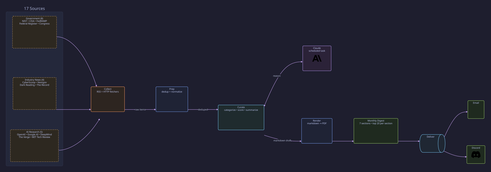

# SPECTRA

**Security Policy, Emerging Cyber Threats, Research & AI**

SPECTRA is an AI-automated monthly cybersecurity policy digest. It collects from 17 public government and industry sources, uses Codex to categorize and summarize items, and renders a branded PDF report in a single scheduled run.

Built for DoD/federal cybersecurity practitioners who need to stay current on policy, threats, and AI developments without manually scanning dozens of feeds.

## What It Produces

A monthly PDF digest with seven sections:

| Section | What's Covered |
|---------|---------------|
| **Executive Summary** | Top 5 items by relevance |
| **Policy & Compliance** | Agency actions, EOs, CISA directives, FedRAMP, CMMC |
| **Publications & Standards** | NIST SPs, CISA guides, strategy docs |
| **Threats & Incidents** | Breaches, APT campaigns, KEVs, ICS advisories |
| **AI & Agentic Developments** | Frontier models, AI policy, agentic capabilities |
| **Legislative Highlights** | Bills with significant movement only |
| **Upcoming Conferences** | 5-10 events for the next 2-3 months |

Each section is limited to the top 20 items by relevance score. Items are scored 1-10 based on direct impact to federal cyber practitioners.

## Sources (17)

**Government (8):** NIST CSRC, CISA Alerts, CISA KEV Catalog, Federal Register API, Congress.gov API, Executive Orders, FedRAMP Notices, FedRAMP Changelog

**Industry News (4):** CyberScoop, Nextgov/FCW, Dark Reading, The Record

**AI (5):** OpenAI Blog, Google AI Blog, DeepMind Blog, The Verge AI, MIT Technology Review AI

All sources are public and unclassified. See `src/collect/config.yaml` for the full configuration.

## Pipeline



The pipeline runs through the Codex `SPECTRA Monthly Report` automation. Codex reads the raw items, categorizes each into the appropriate section, writes a 2-3 sentence summary, scores relevance, consolidates duplicate stories, and assembles the markdown draft and PDF for review. External delivery remains a separate, approval-gated step.

## Setup

### Prerequisites

- Python 3.10+
- Codex desktop (for scheduled curation and report review)

### Install

```bash
git clone https://github.com/JAKSecurity/SPECTRA.git
cd SPECTRA
pip install -r requirements.txt
```

### Run Manually

```bash
# 1. Collect from all sources
PYTHONPATH="." python -m src.collect.runner src/collect/config.yaml data/sources

# 2. Prep (load + dedup)
PYTHONPATH="." python -m src.curate.curate data/sources/2026-04 data/drafts/prepped_2026-04.json

# 3. Curate -- the Codex monthly automation handles model-backed curation

# 4. Render to PDF
PYTHONPATH="." python -m src.render.render data/drafts/2026-04-SPECTRA.md output/2026-04-SPECTRA.pdf
```

### Automated Monthly Run

The Codex `SPECTRA Monthly Report` automation runs at 5 AM on the first of each month. It collects the previous calendar month's sources, curates the report, renders the PDF, and presents the artifacts for review. Email and Discord delivery occur only after approval.

### Tests

```bash
python -m pytest tests/ -q
```

59 tests covering fetchers, prep/dedup, draft assembly, and PDF rendering.

## Project Structure

```
src/
  collect/          Source fetcher modules and config
    config.yaml     Source URLs, types, category hints
    runner.py       Orchestrates fetchers, writes health report
    fetchers/       One module per source type (RSS, Federal Register API, etc.)
  curate/           Item loading, dedup, and draft assembly
  render/           PDF template and rendering (reportlab)
scripts/            Shell entry points for each stage
tests/              59 tests (pytest)
docs/               Design spec and backlog
```

## License

[MIT](LICENSE)
